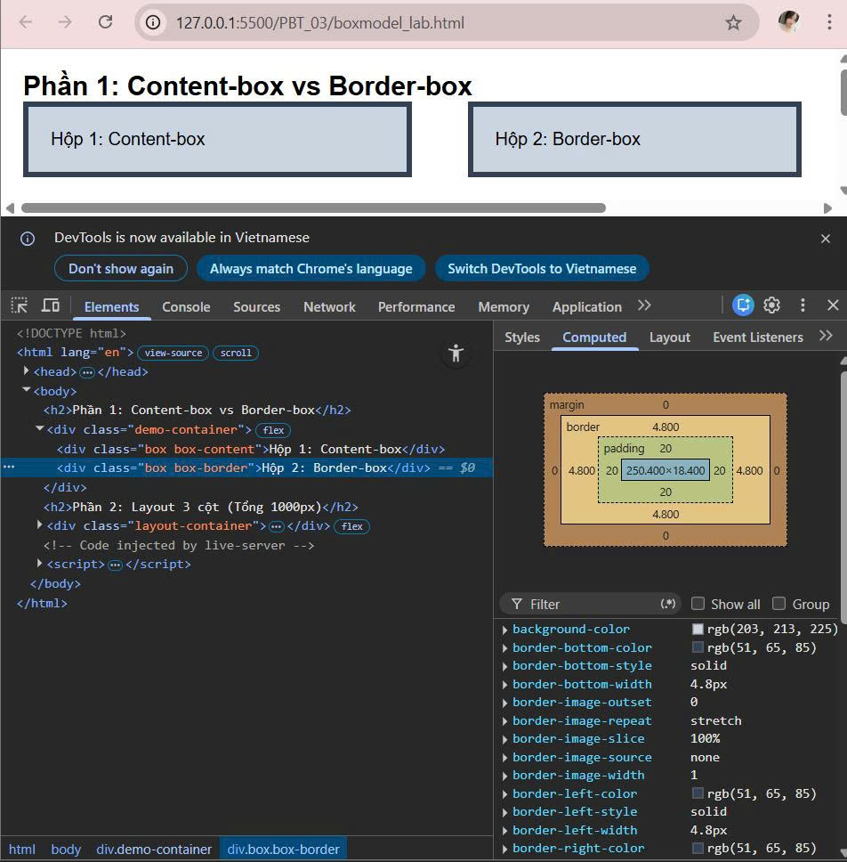
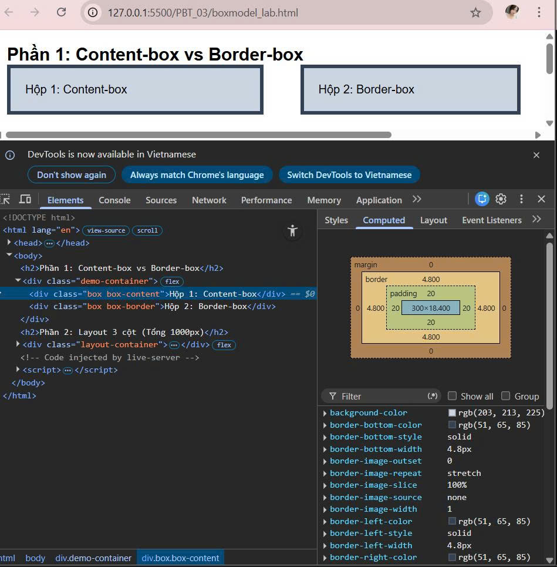
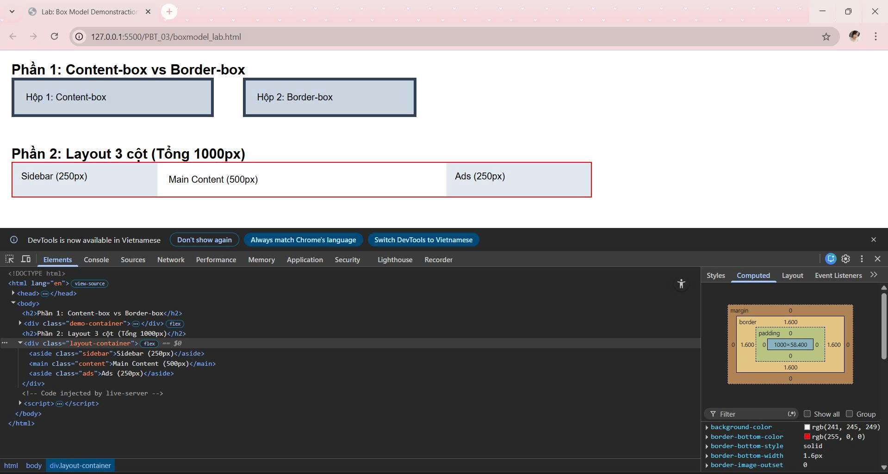
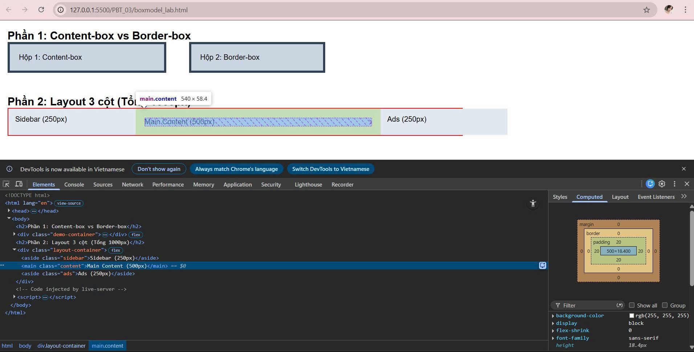
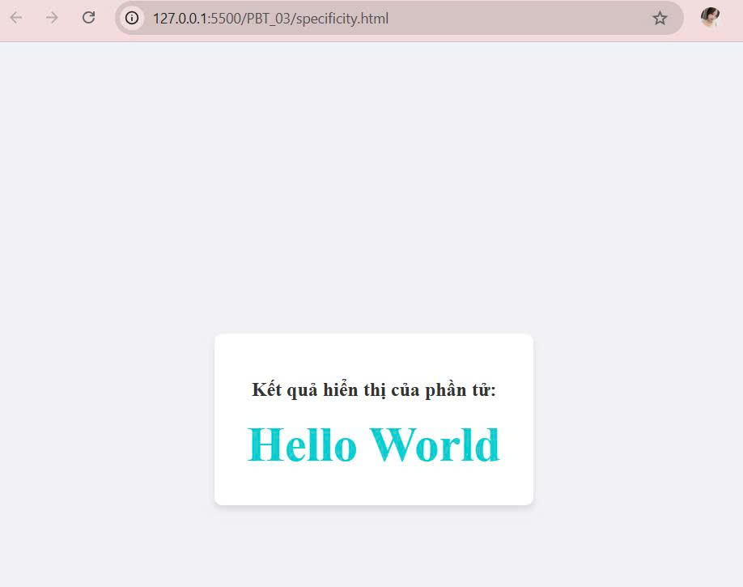

# 📋 PHIẾU BÀI TẬP 03
# **CSS CORE — Selectors, Box Model, Inheritance & Cascade**

## PHẦN A - KIỂM TRA ĐỌC HIỂU

### Câu A1 - 3 cách nhúng css

1. Inline CSS - trong attribute `<style>`:
    - Ví dụ:
        ```html
            <h1 style="color: blue; font-size: 20px; ">Chào mừng bạn đến với blog của tôi!</h1>
        ```
    - Ưu điểm: Nhanh chóng, có độ ưu tiên cao nhất, không cần tạo thêm file.

    - Nhược điểm: Làm code HTML trở nên rối, khó bảo trì, không thể tái dử dụng định dạng cho các phần tử khác.

    - Chỉ nên dùng khi bạn muốn thay đổi nhanh một thuộc tính duy nhất cho một phần tử đặc biệt, hoặc khi viết CSS cho Email HTML.

2. Internal CSS - trong thẻ `<style>`:

    - Ví dụ: 
        ```html
            <head>
                <style>
                    body { background-color: #f0f0f0; }
                    p { color: red; line-height: 1.5; }
                </style>
            </head>
        ```
    - Ưu điểm: Dễ quản lý hơn Inline CSS vì tất cả nằm tập trung 1 chỗ, không cần gửi thêm yêu cầu HTML để tải file bên ngoài.

    - Nhược điểm: Chỉ có tác dụng cho duy nhất một trang web đó, nếu website có nhiều trang, bạn sẽ phải copy đoạn code này sang từng trang, gây lãng phí thời gian.

    - Nên dùng cho các website chỉ có một trang hoặc khi bạn muốn tuỳ chỉnh giao diện riêng biệt cho một trang cụ thể mà không ảnh hưởng đến toàn bộ hệ thống.

3. External CSS - file riêng:

    - Ví dụ:
        File `style.css`:

            ```css
                h1 { color: darkgreen; }
                .container { width: 80%; margin: auto; }
            ```
        File `index.html`:

            ```html
                <head>
                    <link rel="stylesheet" type="text/css" href="style.css">
                </head>
            ```
    - Ưu điểm: 
        - Tách biệt hoàn toàn nội dung (HTML) và giao diện (CSS)
        - Dễ dàng thay đổi giao diện toàn bộ website hàng nghìn trang bằng cách chỉnh sửa 1 file duy nhất
        - Trình duyệt có thể lưu bộ nhớ đệm(cache) giúp tải trang nhanh hơn.
    
    - Nhược điểm: Cần thêm một yêu cầu tải file từ server, nếu file CSS bị lỗi đường dẫn, trang web sẽ mất toàn bộ định dạng.

    - Đây là phương pháp tiêu chuẩn cho mọi dự án website thực tế, đặc biệt là các website có nhiều trang.
**Câu hỏi thêm:** 
    - Inline CSS `>` Internal CSS `>` External CSS
    - Giải thích:
        - Inline CSS: Nằm trực tiếp trong thuộc tính `style` của thẻ
        - Internal CSS & External CSS: Cái nào viết sau sẽ thắng vì code sẽ chạy từ trên xuống dưới.

> Nguồn tham chiếu: 08_introduction_css.md - ⚙️ Core Technical Truth

### Câu A2 — CSS Selectors — Dự đoán kết quả

1. `h1`
    - Chọn: `<h1>ShopTLU</h1>`
    - Text: ShopTLU
2. `.price`
    - Chọn: `<p class="price">25.990.000đ</p>`
            `<p class="price">45.990.000đ</p>`
    - Text: 25.990.000đ
            45.990.000đ
3. `#app header`
    - Chọn: Toàn bộ nội dung trong thẻ `<header>` bao gồm `<h1>` và `<nav>`.
    - Text: ShopTLU Home Product About
4. `nav a:first-child`
    - Chọn: `<a href="/" class="active">Home</a>`
    - Text: Home
5. `product.featured h2`
    - Chọn: `<h2>MacBook Pro</h2>`
    - Text: MacBook Pro
6. `articale > p `
    - Chọn: `<p class="price">25.990.000đ</p>`
            `<p>Mô tả sản phẩm...</p>`
            `<p class="price">45.990.000đ</p>`
            `<p>Mô tả sản phẩm...</p>`
    - Text: của Iphone 16
            của Iphone 16
            của MacBook Pro
            của MacBook Pro
7. `a[href="/"]`
    - Chọn: `<a href="/" class="active">Home</a>`
    - Text: Home
8. `.top-bar.dark h1`
    - Chọn: `<h1>ShopTLU</h1>`
    - Text: ShopTLU

> Nguồn tham chiếu: 09_css_selectors.md - 🌐 Big Picture — Bản đồ Selectors

### Câu A3 — Box Model — Tính toán kích thước

1. Trường hợp 1: `content-box`
    - Chiều rộng hiển thị: 450px
    - Không gian chiếm trên trang: 470px

2. Trường hợp 2: `border-box`
    - Chiều rộng hiển thị: 400px
    - Kích thước content thực tế: 350px
    - Không gian chiếm trên trang: 420px
3. Trường hợp 3: Margin collapsse

    - Khoảng cách giữa các box-a và box-b: 40px
    - Giải thích tại sao KHÔNG PHẢI 65px: Margin dọc giữa 2 block element GỘPLẠI = lấy cái LỚN HƠN

> Nguồn tham chiếu: 11_box_model.md - ⚙️ Core Technical Truth

**Nâng cao:** Khoảng cách giữa box-a và box-b = 30px

### Câu A4 — Specificity (Độ ưu tiên)

1. Bảng tính Specificity Score

    | Rule | Selector | ID (a) | Class (b) | Type (c) | Tổng điểm |
    | :--- | :--- | :---: | :---: | :---: | :--- |
    | **Rule A** | `p` | 0 | 0 | 1 | (0, 0, 1) |
    | **Rule B** | `.price` | 0 | 1 | 0 | (0, 1, 0) |
    | **Rule C** | `#main-price` | 1 | 0 | 0 | (1, 0, 0) |
    | **Rule D** | `p.price` | 0 | 1 | 1 | (0, 1, 1) |

2. Element có màu đỏ
     Vì:  ID - Rule C có quyền năng cao nhất trong 4 selector này, nên rule C thắng tuyệt đối kể cả các selector khác có dài hơn hay không.

3. Nếu thêm `<p class="price" id="main-price" style="color: orange;">`, element có màu cam.
    Vì: Inline `style` có độ ưu tiên cao hơn tất cả các selector nằm trong External CSS(file riêng) hoặc Internal CSS(thẻ `<style>`)   

4. Nếu Rule A thêm `!important`, element có màu đen
    Vì: Từ khóa `!important` là một "vũ khí đặc biệt". Nó không nằm trong thang điểm Specificity thông thường mà nó ghi đè lên tất cả, kể cả Inline style hay ID selector. Khi trình duyệt thấy `!important`, nó sẽ ưu tiên thuộc tính đó ngay lập tức, bất chấp các quy tắc xếp chồng khác.

> Nguồn tham chiếu: 10_inheritance_cascading.md

## PHẦN B — THỰC HÀNH CODE

### Bài B2 — Box Model Lab

1. Phần 1: Chứng minh content-box vs border-box

    - 

    - 

    - Hộp 1: Chiều rộng thực tế = 350px

    - Hộp 2: Chiều rộng thực tế = 300px

    - Giải thích sự khác biệt:
        - Content-box: 
            - Trình duyệt coi `width` chỉ là phần chứa nội dung.
            -  Padding và Border sẽ được cộng thêm ra bên ngoài, làm phần tử phình to hơn dự kiến.
        - Border-box:
            - Trình duyệt  coi `width` là kích thước cuối cùng của hộp.
            - Padding và Border sẽ lấn vào bên trong, giúp kiểm soát layout chính xác hơn.

2. Phần 2: Layout 3 cột

    - Nếu KHÔNG dùng `border-box`:
        TotalWidth = Width + Padding(left+right) + Border(left+right) 
                   = 250 + 30 + 500 + 40 + 250 + 30
                   = 1100px

    - 

    

### Bài B3 — Specificity Battle

 1. Danh sách 10 Rules và Specificity Score

    Sắp xếp theo thứ tự ưu tiên từ thấp đến cao:

    | STT | Selector | Specificity Score | Màu sắc |
    |:---:|:---|:---:|:---|
    | 1 | `*` | 0, 0, 0 | Gray |
    | 2 | `p` | 0, 0, 1 | Silver |
    | 3 | `.text` | 0, 1, 0 | Blue |
    | 4 | `[class~="highlight"]` | 0, 1, 0 | Green |
    | 5 | `p.text` | 0, 1, 1 | Purple |
    | 6 | `.text.highlight` | 0, 2, 0 | Orange |
    | 7 | `p.text.highlight` | 0, 2, 1 | Brown |
    | 8 | `#demo` | 1, 0, 0 | Red |
    | 9 | `p#demo` | 1, 0, 1 | Navy |
    | 10 | `#demo.text.highlight` | 1, 2, 0 | **DeepSkyBlue** |

2. Phần tử cuối cùng hiển thị màu **DeepSkyBlue** 

    - Vì: 
        - Trình duyệt tính toán có độ ưu tiên (Specificity) theo công thức: `(ID, Class/Artribute, Element)`.
        - Rule cuối cùng `#demo.text.highlight` có:
            - 1 ID (`#demo`)
            - 2 Class (`.text`, `.highlight`)
            - 0 Element
        => Điểm: **1 , 2, 0**. Đây là số điểm cao nhất trong tất cả các rule đã viết, nên nó được ưu tiên áp dụng. 

3. 

4. Nếu thay đổi thứ tự rules trong CSS file thì kết quả vẫn không thay đổi. 
Vì:  
    Trong CSS, khi các Selector có **Specificity khác nhau** , trình duyệt sẽ luôn chọn Selector có điểm cao nhất bất kể nó nằm ở vị trí nào và thứ tự viết code chỉ có tác dụng khi hai Selector có **cùng mức Specificity**.

> Nguồn tham chiếu: 10.inheritance_cascading.md - ⚙️ Core Technical Truth
